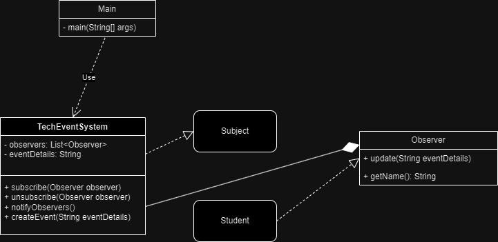
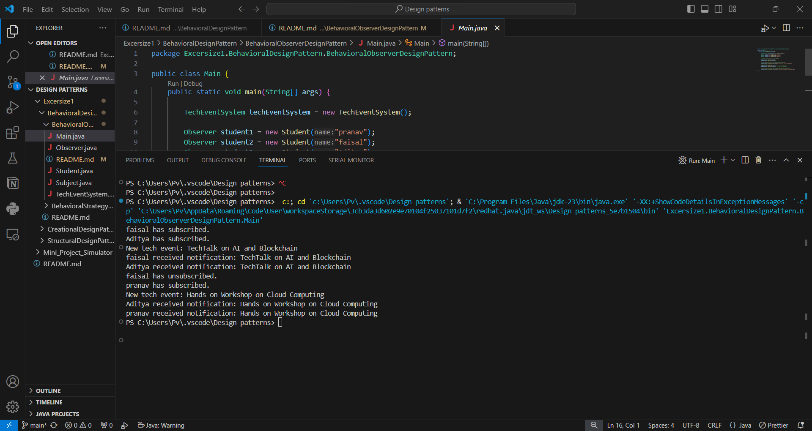

This is all about simple subscription mechanism , subscribe for emails then only get the required info else dont.
this pattern lets you define subscription mechanism to notify multiple objects about any events that happen to the object they're observing.

I have taken an example scenario where in a college for tech events if you subscribe you get notified.
My approach -

Output -

