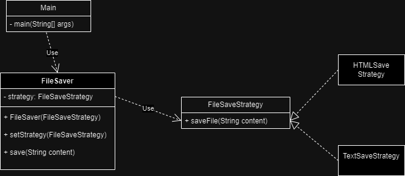
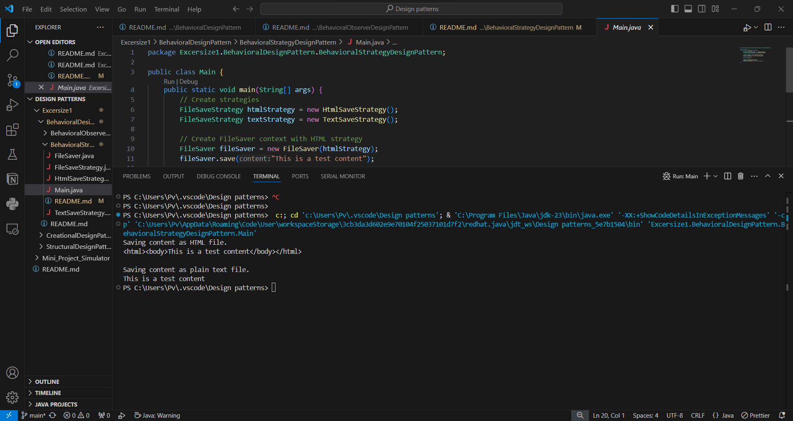

Although in most modern updated language packages ,  this can be implemented with a simple anonymous lamda!
Say i might need to save documents in different formats, based on user preferences on requirements, this strategy pattern allows me to easily switch between diffferent file formats without altering the file saving process! how useful!
My approach is -

Output - 

