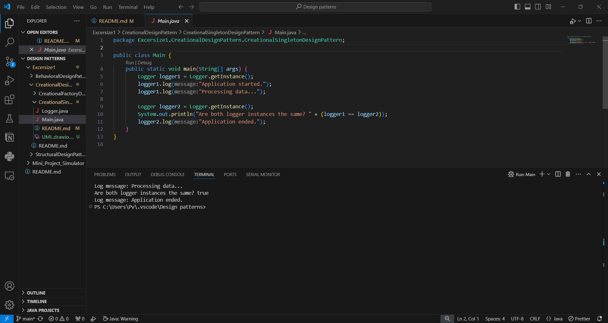

Singleton ensures that class has just a single instance and provide global access to it.
Race_condition is solved by the keyword synchronized.
here use-case scenario is logging service.

Output - 

