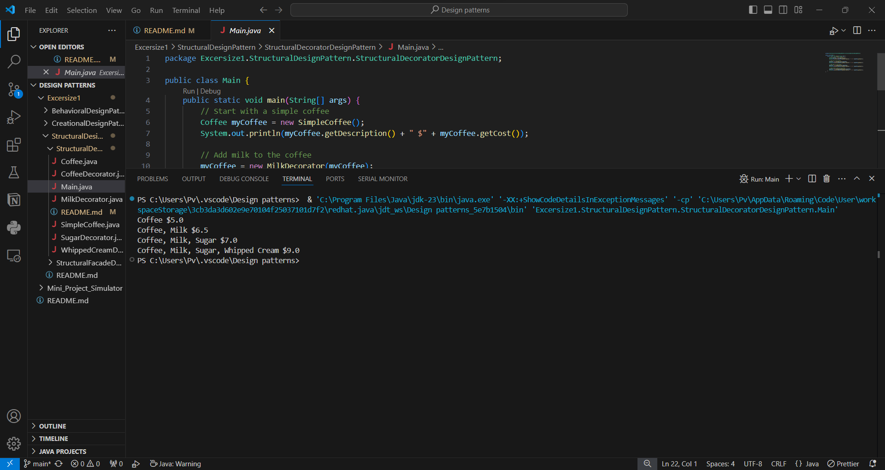

Let's say in my hotel buisness first i added just simple coffee. Slowly people started showing interests and i saw patterns where people take other things with coffee . Hence slowly i introduced more , like coffee with milk , coffee with milk and whipped cream on top. Therefore here for each instance , we are building up new classes with every permutation.
Here class explosion is occuring and thus here i have used the decorator design pattern.
It lets me attach new behaviors to objects by placing inside special wrapper objects which contain this behaviors.

My approach for this -
.png)

Output - 

