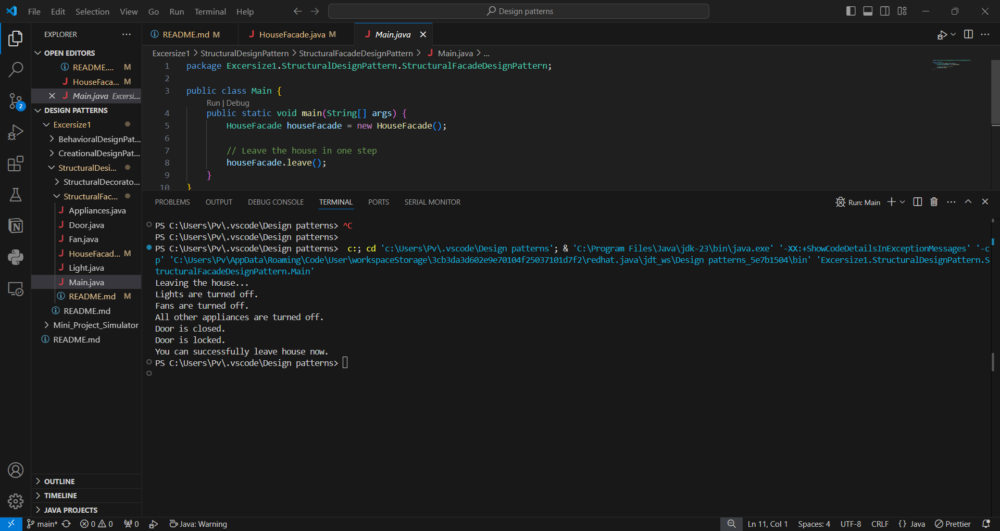

Now say i have to autmate things while leaving the house, i'll do / call various functions like turn_off_lights(),turn_off_fans(),close_door(),lock_door() etc. If i do one by one i might miss one of them , hence i will wrap this all inside a function say - leave() and just call this, here less errors and i will check all things without missing.
Facade provides simplified interface to a library or any complex set of classes.
My usecase scenario is -

Output -

