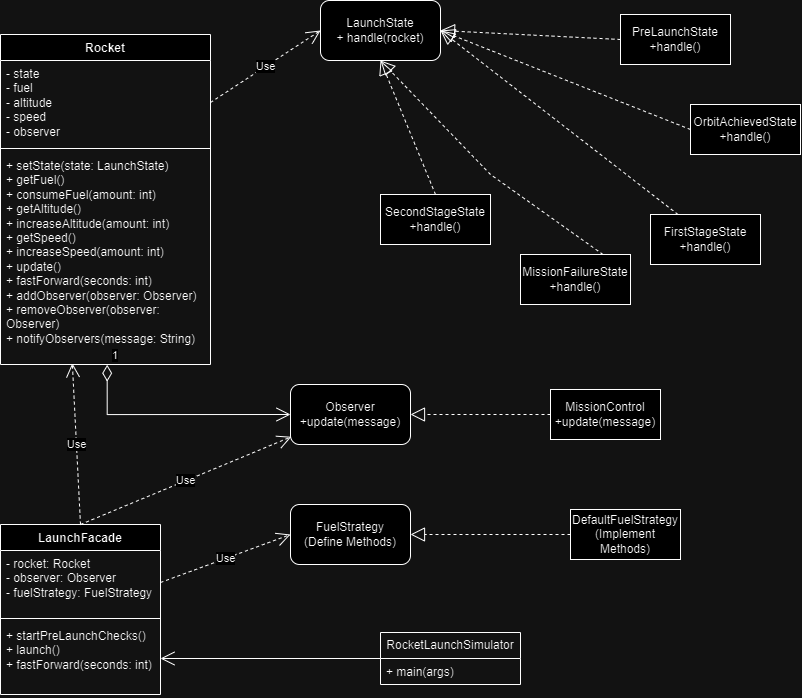
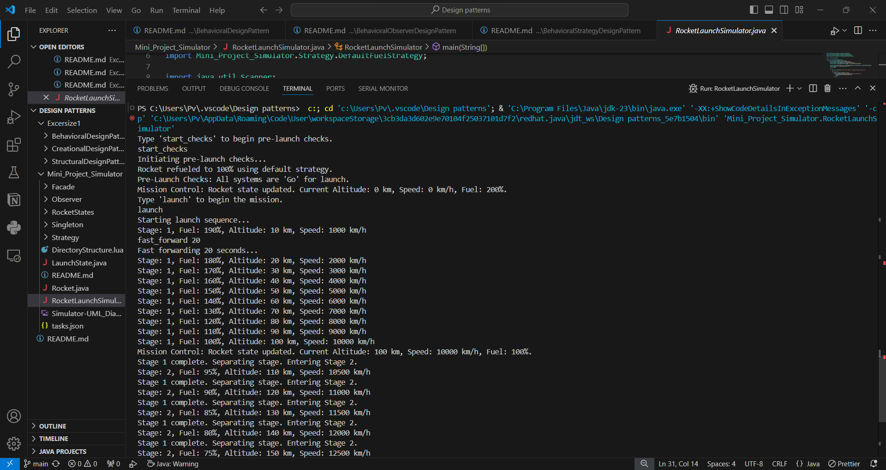
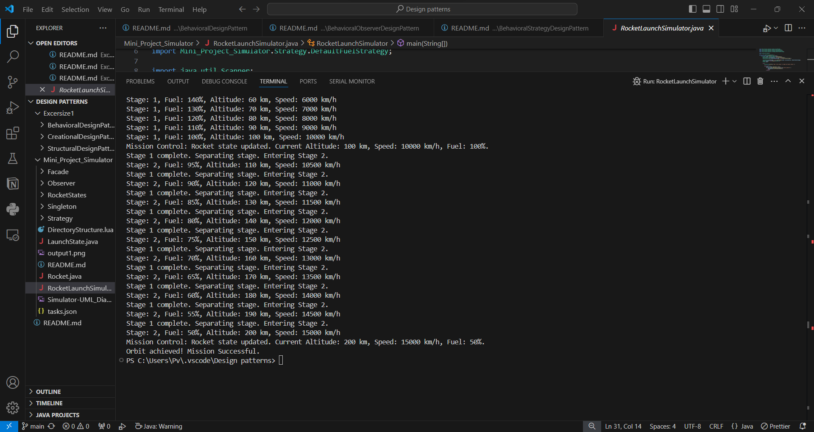

# Rocket Launch Simulator

## Table of Contents
1. [Introduction](#introduction)
2. [Motivation](#motivation)
3. [Project Description](#project-description)
4. [Implementation Details](#implementation-details)
    - [My Approach](#my-approach)
    - [Class Structure](#class-structure)
5. [How This Project Is Different](#how-this-project-is-different)
6. [My Future Improvements To This](#my-future-improvements-to-this)
7. [Outputs](#output)

## Introduction
Here i tried to simulates a rocket launch sequence using various patterns&OOPs concepts.This progresses through different stages of launch, from pre-launch checks to orbit achievement.

## Motivation
I was looking into the design patterns and then i saw this problem statement and thought to try those patterns here to properly grasp the concepts.

## Project Description
Console based simulation of rocket journey till orbit.Observers are notified of critical events, and different strategies can be applied for fuel management, making the system adaptable and extensible.

## Implementation Details

### My Approach

### Class Structure
- **Rocket**: Represents the core entity of the simulation. Manages its state, fuel, altitude, and speed.
- **LaunchState Interface**: Defines the handle method for various launch stages.
- **RocketStates Package**: Contains classes implementing different states of the rocket.
- **Observer Interface**: Defines the `update()` method for classes interested in receiving notifications from the rocket.
- **FuelStrategy Interface**: Defines the `calculateFuelConsumption()` method for different fuel strategies.
- **LaunchFacade**: Provides simplified methods for interacting with the rocket simulation.

## How This Project Is Different
Well , i tried to implement the various design patterns and hence all the complexity but i was able to nicely structure it and try to implement it because of my deatiled strucuture , which i have shown here - 

## My Future Improvements to this
- I will try to Implement additional states like `AbortState` for emergency situations.
- I will develop a graphical interface to visualize the rocket's journey in real-time then it will be more comprehensive.
- Expand the `FuelStrategy` interface to include more realistic fuel consumption models.
- There are still errors and memory wastage which i have observed hence will keep optimising it.

## Outputs

